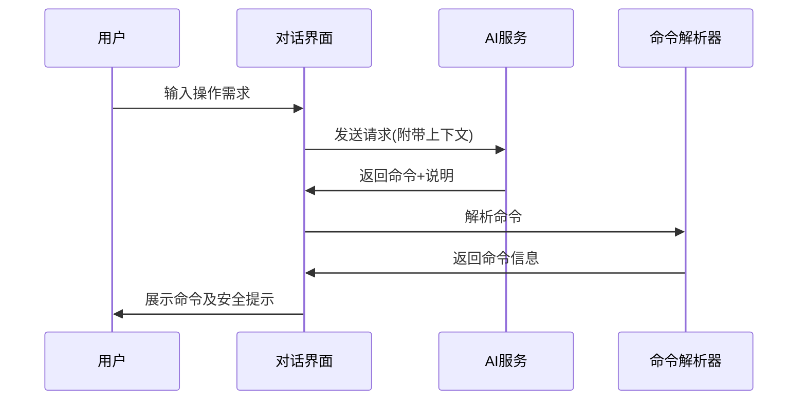
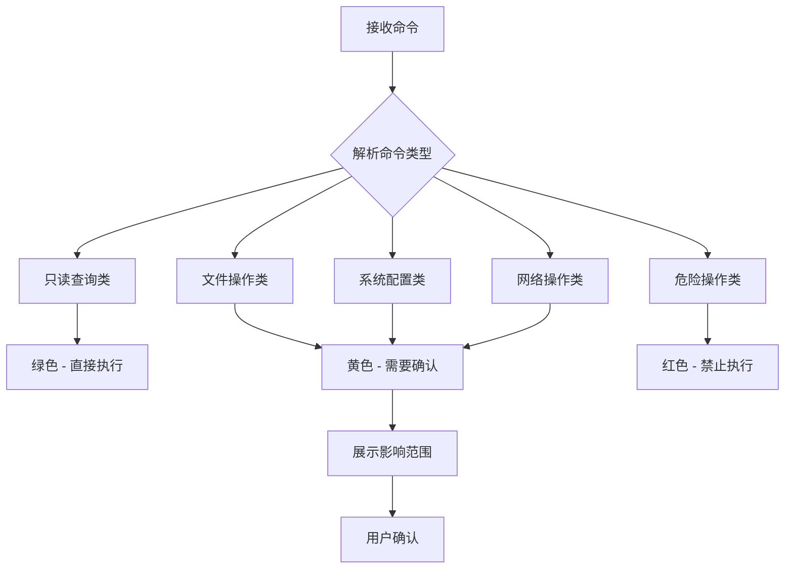
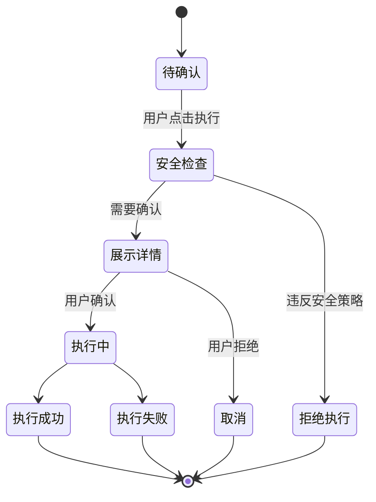
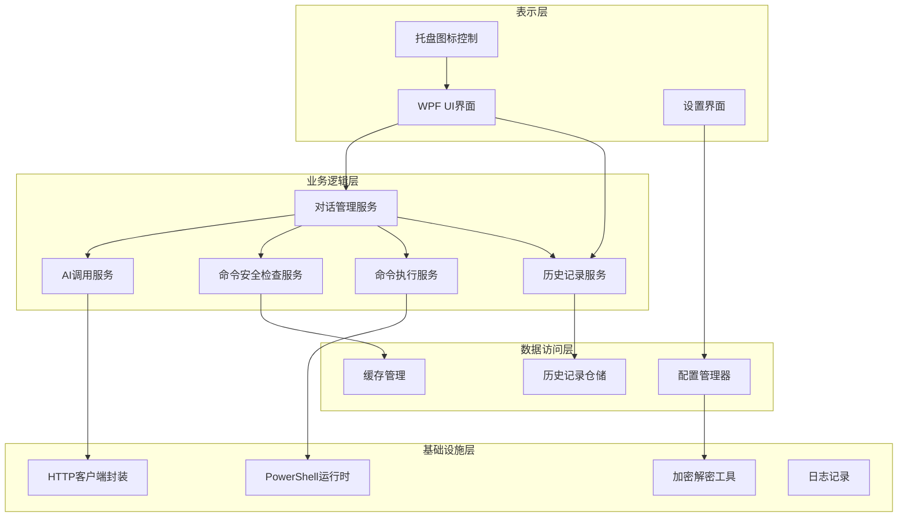
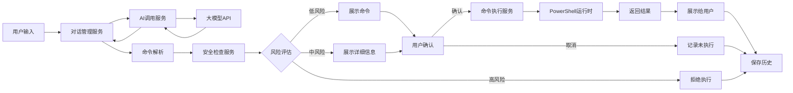
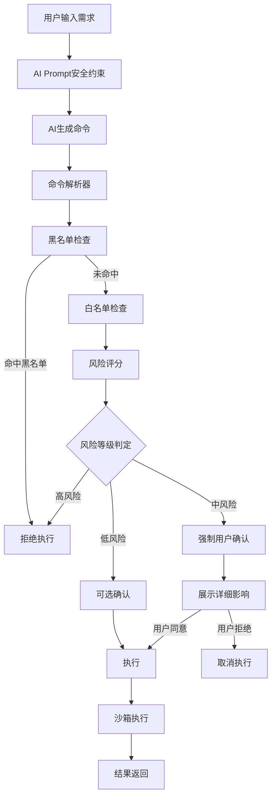

# PowerShell桌面助手 - 系统设计文档

## 一、项目概述

### 1.1 项目背景
Windows用户在执行系统操作时,常常不熟悉PowerShell或CMD命令,需要频繁搜索命令语法,效率低下。本项目旨在构建一个智能桌面助手,通过自然语言对话生成PowerShell命令,提升操作效率。

### 1.2 核心目标
- 通过自然语言交互生成PowerShell命令
- 提供安全可控的命令执行机制
- 支持多种大模型API配置
- 常驻系统托盘,快捷访问
- 保障系统安全,避免危险操作

### 1.3 目标用户
- Windows 11用户
- 不熟悉PowerShell命令的普通用户
- 需要快速执行系统操作的技术人员

## 二、功能架构

### 2.1 核心功能模块

#### 2.1.1 对话交互模块
**职责**: 提供用户与AI对话的界面,处理自然语言输入输出

**核心能力**:
- 支持文本输入框输入用户需求
- 展示AI返回的命令及解释说明
- 维护对话上下文,支持多轮对话
- 展示命令执行结果

**交互流程**:

#### 2.1.2 AI模型集成模块
**职责**: 管理多种大模型API的调用和配置

**支持的模型服务**:
- OpenAI (GPT系列)
- Azure OpenAI
- 阿里云通义千问
- 豆包
- deepseek
- 支持的模型后续可扩展

**配置参数**:

| 参数名称 | 说明 | 是否必填 | 默认值 |
|---------|------|---------|--------|
| 模型提供商 | 选择使用的AI服务 | 是 | - |
| API密钥 | 认证密钥 | 是 | - |
| API端点 | 服务地址 | 否 | 根据提供商自动设置 |
| 模型名称 | 具体模型版本 | 否 | 根据提供商默认 |
| 超时时间 | 请求超时(秒) | 否 | 30 |
| 最大Token数 | 单次请求最大Token | 否 | 2000 |

**提示词策略**:
系统将内置专门的Prompt模板,指导AI生成安全、规范的PowerShell命令,包含:
- 角色定义: 定义AI为PowerShell专家助手
- 输出格式要求: 要求返回结构化的命令+说明
- 安全约束: 禁止生成格式化磁盘、删除系统文件等危险操作
- 命令验证: 要求AI在生成命令前进行安全性说明

#### 2.1.3 命令安全检查模块
**职责**: 对AI生成的命令进行安全性评估和风险分级

**安全策略级别**:

| 策略级别 | 适用场景 | 检查严格度 | 说明 |
|---------|---------|-----------|------|
| 严格模式 | 生产环境、新手用户 | 高 | 仅允许只读命令和安全的系统信息查询 |
| 标准模式 | 日常使用 | 中 | 允许文件操作、网络操作,但需确认 |
| 宽松模式 | 高级用户 | 低 | 允许大部分操作,仅拦截明确的危险命令 |

**命令分类机制**:

**危险命令黑名单(示例)**:
- 格式化磁盘命令: Format-Volume, diskpart等
- 系统文件删除: Remove-Item涉及系统目录
- 注册表危险操作: 删除关键注册表项
- 权限提升命令: 绕过执行策略的操作
- 批量删除: 递归删除大范围目录
- 进程终止: 终止系统关键进程

**白名单命令(严格模式下允许)**:
- 文件查询: Get-ChildItem, Get-Content, Get-Item
- 系统信息: Get-Process, Get-Service, Get-ComputerInfo
- 网络信息: Get-NetAdapter, Test-Connection
- 帮助命令: Get-Help, Get-Command

**风险评估维度**:

| 评估维度 | 检查内容 | 风险等级判定 |
|---------|---------|------------|
| 命令动词 | Remove, Format, Stop, Disable等 | 高风险动词标记为黄色/红色 |
| 操作路径 | 是否涉及系统目录、Program Files等 | 系统路径提升风险等级 |
| 参数特征 | -Force, -Recurse, -Confirm:$false等 | 强制参数提升风险 |
| 影响范围 | 批量操作、通配符使用 | 大范围操作需明确提示 |

#### 2.1.4 命令执行模块
**职责**: 在用户确认后安全地执行PowerShell命令

**执行流程**:

**确认界面信息展示**:

对于需要确认的命令,界面应展示:
- 命令完整文本
- 命令用途说明(AI生成)
- 风险等级标识(绿色/黄色/红色)
- 预期影响范围
- 涉及的文件/目录路径(如有)
- 受影响的文件数量(对于批量操作)

**特殊处理**:

| 操作类型 | 特殊处理方式 |
|---------|------------|
| 文件创建 | 显示文件路径、大小、类型 |
| 文件删除 | 列出待删除文件清单(不超过100项) |
| 文件修改 | 提供在默认编辑器中打开文件的选项 |
| 目录操作 | 展示目录树结构和文件统计 |
| 网络请求 | 显示目标地址和端口 |

**执行环境**:
- 创建独立的PowerShell进程执行命令
- 捕获标准输出和错误输出
- 设置执行超时机制(默认60秒,可配置)
- 支持长时间运行命令的进度反馈

#### 2.1.5 文件操作辅助模块
**职责**: 对于需要编辑的文件提供快速打开功能

**辅助功能**:
- 检测命令是否涉及文件修改操作
- 提供"在编辑器中打开"按钮
- 支持配置默认编辑器(记事本、VS Code、Notepad++等)
- 执行后自动定位到目标文件位置

**编辑器配置**:

| 编辑器 | 检测方式 | 启动命令模板 |
|-------|---------|------------|
| Notepad | 系统内置 | notepad.exe {文件路径} |
| VS Code | 检测安装路径 | code {文件路径} |
| Notepad++ | 检测安装路径 | notepad++ {文件路径} |
| 自定义 | 用户配置 | {自定义路径} {文件路径} |

#### 2.1.6 历史记录模块
**职责**: 保存命令执行历史,支持查看和重新执行

**记录内容**:

| 字段名 | 类型 | 说明 |
|-------|------|------|
| 时间戳 | 日期时间 | 命令执行时间 |
| 用户输入 | 文本 | 原始自然语言需求 |
| 生成命令 | 文本 | AI生成的PowerShell命令 |
| 执行状态 | 枚举 | 成功/失败/已取消/未执行 |
| 执行结果 | 文本 | 标准输出或错误信息 |
| 风险等级 | 枚举 | 绿色/黄色/红色 |

**历史记录功能**:
- 按时间倒序展示历史记录
- 支持搜索和筛选(按关键词、时间范围、执行状态)
- 点击历史记录可重新执行(需再次确认)
- 支持导出历史记录为CSV或JSON
- 定期清理历史记录(可配置保留天数,默认30天)

**存储方式**:
- 使用SQLite本地数据库存储
- 存储路径: %LOCALAPPDATA%\PowerShellHelper\history.db
- 敏感信息(如包含密码的命令)不记录详细参数

#### 2.1.7 系统托盘模块
**职责**: 提供常驻托盘的快捷访问入口

**托盘功能**:
- 显示应用图标和状态提示
- 单击图标: 显示/隐藏主对话窗口
- 右键菜单选项:
  - 打开主窗口
  - 查看历史记录
  - 设置
  - 退出应用

**窗口行为**:
- 关闭主窗口时最小化到托盘而不是退出
- 支持窗口置顶选项
- 记忆窗口位置和大小
- 支持全局快捷键唤醒(可配置,默认Ctrl+Shift+P)

#### 2.1.8 设置管理模块
**职责**: 管理应用的各项配置

**配置项分类**:

**AI模型配置**:
- 模型提供商选择
- API密钥管理(加密存储)
- 自定义API端点
- 模型参数调整

**安全策略配置**:
- 安全级别选择(严格/标准/宽松)
- 自定义黑名单命令
- 自定义白名单命令
- 是否允许执行未知命令

**界面配置**:
- 主题选择(浅色/深色)
- 字体大小调整
- 默认文本编辑器
- 全局快捷键设置

**历史记录配置**:
- 历史保留天数
- 是否记录敏感命令
- 自动清理策略

**存储方式**:
- 配置文件路径: %LOCALAPPDATA%\PowerShellHelper\config.json
- API密钥使用Windows DPAPI加密存储
- 支持配置导入导出(敏感信息除外)

## 三、技术架构

### 3.1 技术选型

| 技术领域 | 选型 | 说明 |
|---------|------|------|
| UI框架 | WPF (.NET 6+) | 现代化桌面UI,与PowerShell深度集成 |
| 编程语言 | C# | .NET生态,与PowerShell原生互操作 |
| PowerShell集成 | System.Management.Automation | 官方PowerShell SDK |
| 数据存储 | SQLite | 轻量级本地数据库 |
| HTTP客户端 | HttpClient | .NET标准HTTP库 |
| JSON处理 | System.Text.Json | 高性能JSON序列化 |
| 加密存储 | DPAPI | Windows数据保护API |

### 3.2 架构分层

### 3.3 数据流设计

## 四、用户界面设计

### 4.1 主对话窗口

**布局结构**:
- 顶部: 标题栏(应用名称、最小化、关闭按钮)
- 中部: 对话历史展示区域(滚动视图)
- 底部: 输入框和发送按钮
- 右上角: 设置按钮、历史记录按钮

**对话消息展示**:
- 用户消息: 靠右对齐,浅色背景
- AI回复: 靠左对齐,深色背景
- 命令块: 使用等宽字体,带复制按钮
- 执行结果: 折叠/展开显示,区分成功/失败状态

### 4.2 命令确认对话框

**信息展示区域**:
- 命令文本(可复制)
- 命令说明
- 风险等级指示器(颜色标识)
- 影响范围说明
- 文件列表(如适用)

**操作按钮**:
- 执行按钮(绿色/黄色根据风险等级)
- 取消按钮
- 在编辑器中打开(针对文件操作)
- 复制命令

### 4.3 设置界面

**多标签页组织**:
- AI模型配置页
- 安全策略页
- 界面偏好页
- 历史记录管理页
- 关于页面

**每页布局**:
- 左侧: 配置项列表
- 右侧: 详细设置和说明
- 底部: 保存、取消、恢复默认按钮

### 4.4 历史记录窗口

**功能区域**:
- 顶部: 搜索框、筛选条件(时间、状态)
- 中部: 历史记录列表(表格或卡片视图)
- 底部: 导出按钮、清空历史按钮

**记录项展示**:
- 时间戳
- 用户需求(摘要)
- 生成的命令(可展开)
- 执行状态图标
- 操作按钮(重新执行、删除)

## 五、安全机制设计

### 5.1 多层安全防护

### 5.2 风险评分算法

**评分维度及权重**:

| 维度 | 权重 | 评分规则 |
|-----|------|---------|
| 命令动词风险 | 40% | Remove/Format/Stop=高分, Set/New=中分, Get/Show=低分 |
| 路径风险 | 30% | 系统目录=高分, 用户目录=中分, 当前目录=低分 |
| 参数风险 | 20% | -Force/-Recurse=高分, 普通参数=低分 |
| 影响范围 | 10% | 通配符/批量=高分, 单项=低分 |

**风险等级映射**:
- 总分 ≥ 70: 红色(禁止执行)
- 总分 40-69: 黄色(必须确认)
- 总分 < 40: 绿色(可直接执行或简单提示)

### 5.3 执行环境隔离

**隔离措施**:
- 使用独立PowerShell进程执行命令
- 不继承当前用户的完整环境变量
- 限制执行策略(避免运行未签名脚本)
- 设置工作目录为用户指定的安全目录
- 超时自动终止机制

### 5.4 敏感信息保护

**保护策略**:
- API密钥使用DPAPI加密存储
- 历史记录中脱敏密码、Token等敏感参数
- 不记录包含敏感关键词的命令详情
- 导出历史记录时移除敏感字段
- 应用退出时清空内存中的敏感数据

## 六、异常处理策略

### 6.1 AI服务异常

| 异常类型 | 处理方式 | 用户提示 |
|---------|---------|---------|
| 网络超时 | 重试3次,指数退避 | "网络连接超时,请检查网络设置" |
| API密钥无效 | 停止请求,引导设置 | "API密钥验证失败,请检查配置" |
| 配额超限 | 停止请求,记录日志 | "API调用次数已达上限" |
| 返回格式错误 | 请求AI重新生成 | "AI返回格式异常,正在重试" |
| 服务不可用 | 记录错误,提示用户 | "AI服务暂时不可用" |

### 6.2 命令执行异常

| 异常类型 | 处理方式 | 用户提示 |
|---------|---------|---------|
| 权限不足 | 捕获异常,提示提升权限 | "需要管理员权限,是否以管理员身份重启?" |
| 命令不存在 | 展示错误信息 | "命令未找到,请检查PowerShell版本" |
| 参数错误 | 展示详细错误,建议修正 | "命令参数错误: {具体错误}" |
| 执行超时 | 终止进程,记录状态 | "命令执行超时已终止" |
| 运行时错误 | 捕获并展示错误堆栈 | "执行失败: {错误原因}" |

### 6.3 数据存储异常

| 异常类型 | 处理方式 | 用户提示 |
|---------|---------|---------|
| 数据库损坏 | 尝试修复,失败则重建 | "数据异常,正在修复" |
| 磁盘空间不足 | 清理旧记录,压缩数据 | "磁盘空间不足,已清理历史记录" |
| 配置文件损坏 | 加载默认配置 | "配置已重置为默认值" |
| 读写权限不足 | 尝试更换存储路径 | "无法写入数据,请检查权限" |

## 七、性能优化策略

### 7.1 响应速度优化
- AI请求异步处理,避免UI阻塞
- 命令执行结果流式返回,实时展示输出
- 历史记录分页加载,单页50条
- 设置界面延迟加载非关键配置项

### 7.2 资源占用优化
- 托盘常驻时最小化内存占用(目标<50MB)
- 主窗口隐藏时释放非必要资源
- 历史记录定期归档和压缩
- 限制日志文件大小(最大10MB,自动轮转)

### 7.3 缓存策略
- 缓存AI模型配置,避免重复读取
- 缓存常用命令的安全评分结果
- 缓存编辑器路径检测结果
- 对话上下文维持最近10轮,超出则摘要压缩

## 八、部署与安装

### 8.1 安装包要求
- 支持Windows 11 (x64)
- 需要.NET 6运行时(安装包内嵌或引导下载)
- 安装后自动添加到开机启动(可选)
- 支持静默安装和卸载

### 8.2 安装流程
- 欢迎页面
- 许可协议
- 选择安装路径
- 选择是否开机启动
- 安装文件
- 完成(勾选"立即运行")

### 8.3 首次运行引导
- 欢迎界面简介
- 配置AI模型API密钥
- 选择安全策略级别
- 简短使用教程(可跳过)
- 进入主界面

## 九、后续扩展方向

### 9.1 功能增强
- 支持自定义命令模板库
- 支持命令组合和脚本生成
- 支持远程服务器PowerShell执行
- 集成常用系统工具快捷入口
- 支持语音输入

### 9.2 智能化提升
- 基于历史记录的命令推荐
- 学习用户习惯,优化提示词
- 多步骤任务自动拆解
- 错误命令自动修正建议

### 9.3 协作与分享
- 命令模板云端同步
- 分享常用命令给其他用户
- 企业版集中策略管理
- 团队知识库集成

